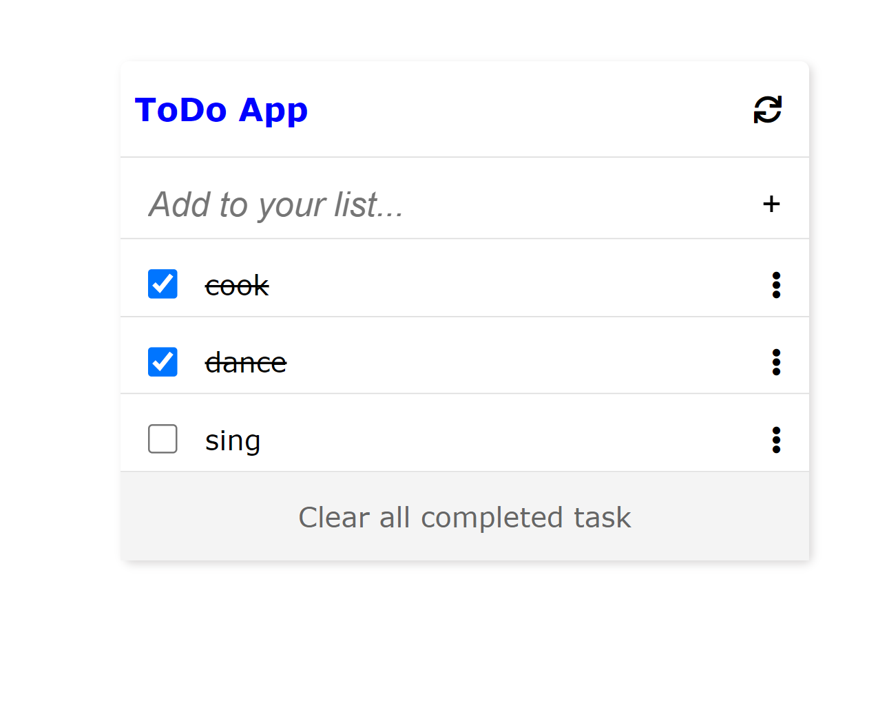

# Project

> Todo List App.

This project entails Building a responsive Todo list app which allows you to add and remove a task. The design was gotten from minimalist.

## Built With

- Html
- Css
- Javascript
- Webpack

## Live Demo

[Live Demo Link](https://ayoubms.github.io/To-Do-list/)

## Getting Started

To get a local copy up and running follow these simple steps.

- You can clone this repo by typing `git clone https://github.com/ayoubms/To-Do-list.git` on your terminal
- Type `cd To-Do-list` to access the project on the terminal

## Authors

👤 **Ayoub Chahir**

- GitHub: [@githubhandle](https://github.com/AyoubMs)
- LinkedIn: [LinkedIn](https://www.linkedin.com/in/ayoub-chahir/)

## 🤝 Contributing

Contributions, issues, and feature requests are welcome!

Feel free to check the [issues page](https://github.com/AyoubMs/To-Do-list/issues).

## Show your support

Give a ⭐️ if you like this project!

## 📝 License

This project is [MIT](./MIT.md) licensed.
